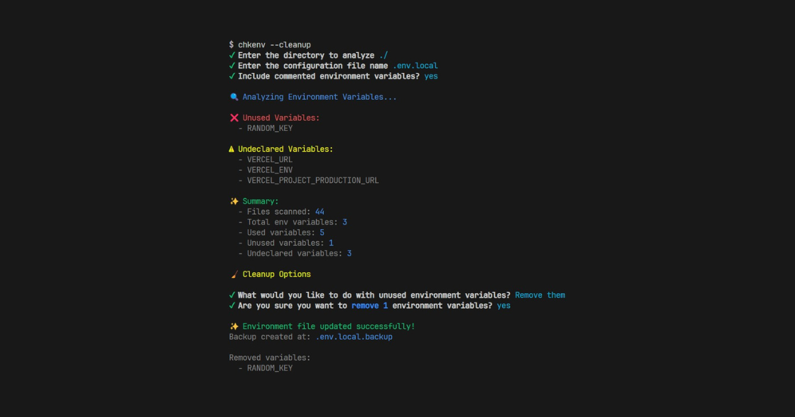

# chkenv

The environment variable detective your codebase needs. Free. Open Source. **It helps you identify unused environment variables declared in your `.env` file and undeclared environment variables used in your code.**.

## Documentation

Visit https://chkenv.sudipbiswas.dev to view the documentation.

## Contributing

Contributions are welcome! Please feel free to submit a Pull Request.

## More

For any help or queries, you can reach out to me on [X](https://x.com/sudipbiswas_dev)
